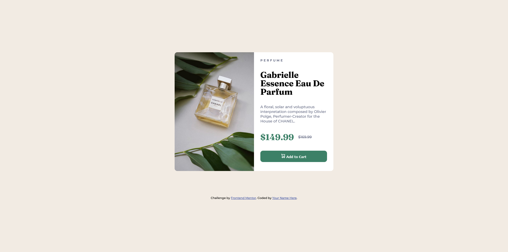

# Frontend Mentor - Product preview card component solution

This is a solution to the [Product preview card component challenge on Frontend Mentor](https://www.frontendmentor.io/challenges/product-preview-card-component-GO7UmttRfa). Frontend Mentor challenges help you improve your coding skills by building realistic projects. 

## Table of contents

- [Overview](#overview)
  - [The challenge](#the-challenge)
  - [Screenshot](#screenshot)
  - [Links](#links)
- [My process](#my-process)
  - [Built with](#built-with)
  - [What I learned](#what-i-learned)
  - [Continued development](#continued-development)
  - [Useful resources](#useful-resources)
- [Author](#author)

## Overview

### The challenge

Users should be able to:

- View the optimal layout depending on their device's screen size
- See hover and focus states for interactive elements

### Screenshot

### Links

- Solution URL: [Frontend Mentor Solutions](https://www.frontendmentor.io/solutions/product-preview-card-using-htmlcss-hPtVdb95A7)
- Live Site URL: [GitHub Pages](https://johnmcdoe.github.io/product-preview-card-component-main/)

## My process

### Built with

- Semantic HTML5 markup
- CSS custom properties
- Flexbox
- Mobile-first workflow

### What I learned

I learnt how to create even columns with Flexbox. I also learnt how to use media queries, and with that about the picture tag which lets you switch image sources depending on how you set its 'srcset' and 'media' attributes.

### Continued development

Even though my solution resembles the design, I couldn't figure out how to remove the overflow which happens when the window gets too small. I'd like the content to shrink instead of disappearing at the sides.

### Useful resources

- [MDN Web Docs](https://developer.mozilla.org/en-US/)
- [Kevin Powell Youtube Channel](https://www.youtube.com/@KevinPowell/featured) - High-quality content creator who mainly produces videos about CSS. Highly recommend his channel if you want to learn CSS.

## Author

- Website - [Add your name here](https://www.your-site.com)
- Frontend Mentor - [@JohnMcDoe](https://www.frontendmentor.io/profile/JohnMcDoe)
